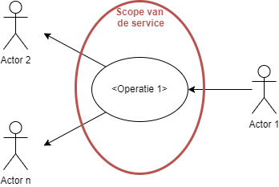
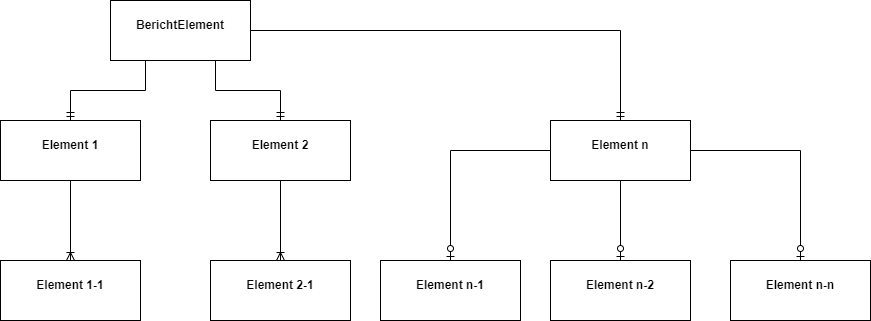
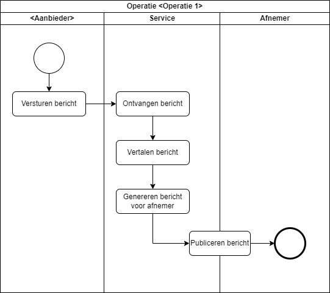

## Template Service Specificatie

### Service overzicht
| Item |  |
|------|--|
| Servicenaam   |  |
| Serviceversie |  |
| Service beschrijving | |
| Opmerkingen | |
| Datum in productie | |
| Datum vervallen | |
| Service eigenaar | Naam van de eigenaar, e-mailadres, afnemer |
| Afname locatie | ESB Post21, PIADD, KA (verwijder wat niet van toepassing is) |

### Roadmap
Voor de service staan de volgende wijzigingen op de planning:
- geen wijzigingen gepland

### Service Abstract
Kort en bondige beschrijving van de service

### Servicecontext
Context van de service in woord en beeld

## Service operaties
### Operatie 1

#### Omschrijving
Functionaliteit van de operatie

#### Trigger
Geef aan waardoor de service getriggert wordt, bijvoorbeeld *Ontvangst bericht*

#### Interface beschrijving

Figuur 1 Samenhang berichtelementen van Operatie 1, voor het XML bericht zie Appendix A

#### Interactie patroon
Deze service werkt volgens het volgende patroon: 
- In-Only (one-way)
- In Out (Synchroon, Request-Response)
- In Out (Asynchroon, Request-Response)
- Out Only (Notification)
- Out In (Solicit-Response)

#### Observeerbaar gedrag

*Basis flow (happy flow)* 
1. <Aanbieder> publiceert het <berichtnaam> bericht
2. De service ontvangt het bericht [1], vertaalt het [2] en stelt het beschikbaar aan de afnemer
3. De service levert het bericht af bij de afnemer [3]
4. Service operatie is klaar

*Alternatieve flows* 
Geef aan of er andere scenario’s mogelijk zijn

*Exceptie flows* 
Geef aan hoe de service met excepties omgaat

#### Security
Geen additionele beveiligingsmaatregelen nodig buiten de standaard ESB maatregelen. OF
Deze service maakt gebruik van WS Security | Basic Authentication.

#### Performance
| Karakteristiek | Omschrijving   |
|----------------|----------------|
| Avg # Requests |                |
| Max # Requests |                |
| Avg Latency (sec) | <<Ingeval van Request Reply de roundtrip, in geval van Pub Sub de vertraging van trigger tot observeerbaar gedrag>> |
| Max Latency (sec) | |
| Peaktime |    |
| Avg Message size | |
| Max Message size |  |
| Quality of Service | - Best Effort |
|                    | - At Least Once |
|                    | - Exactly Once |

## Document informatie
### Referenties

| Referentie | Document |
|------------|----------|
| [CDM](https://www.example.com) | ProRail CDM - Richtlijnen en Beheer |
| [AUTH-BRON](https://www.example.com) | Authentieke bronnen en eigenaarschap gegevens, IB en ICT-S/AI&B |
| [AUTH-BRON-LIJST](https://www.example.com) | Lijst authentieke bronnen en gegevenseigenaren, IB en ICT-S/AI&B |
| [PIA](https://www.example.com) | ProRail Integratie Architectuur |
| [SD](https://www.example.com)  | |

### Afkortingen
| Term | Betekenis |
|------|-----------|
| ESB  | Enterprise Service Bus |
| | |          

### Versiebeheer
| Versie | Datum       | Auteur         | Wijzigingen                 |
|--------|-------------|----------------|-----------------------------|
|        | dd-mm-jjjj  |                |                             |

## Schema's
### Bericht <naam>

### CMM XSD
*op aparte tab*
